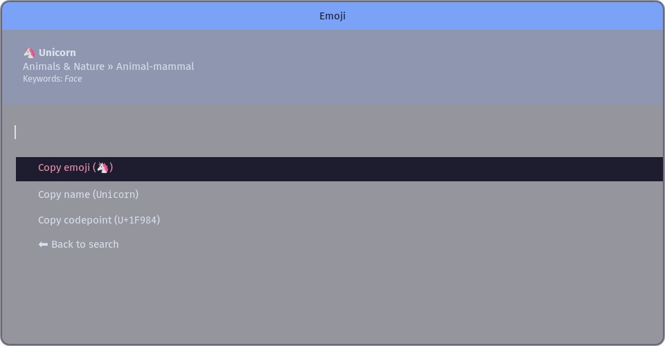
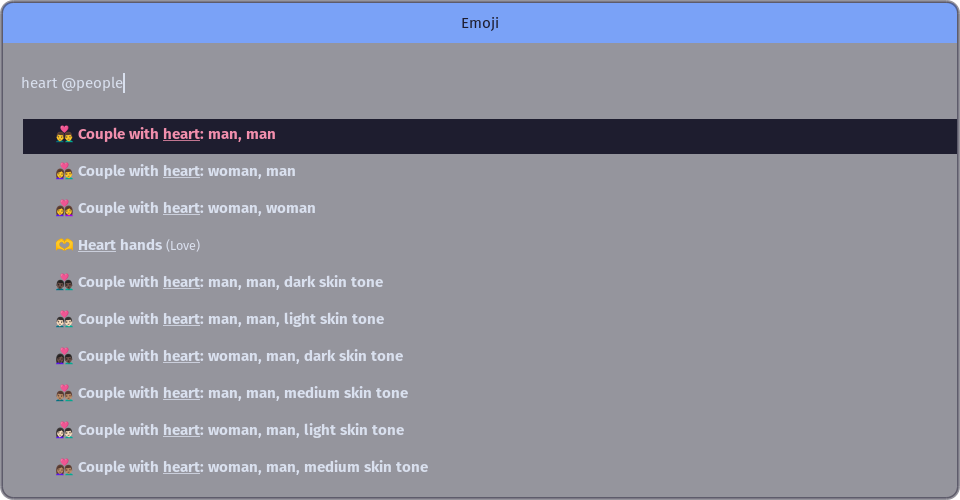
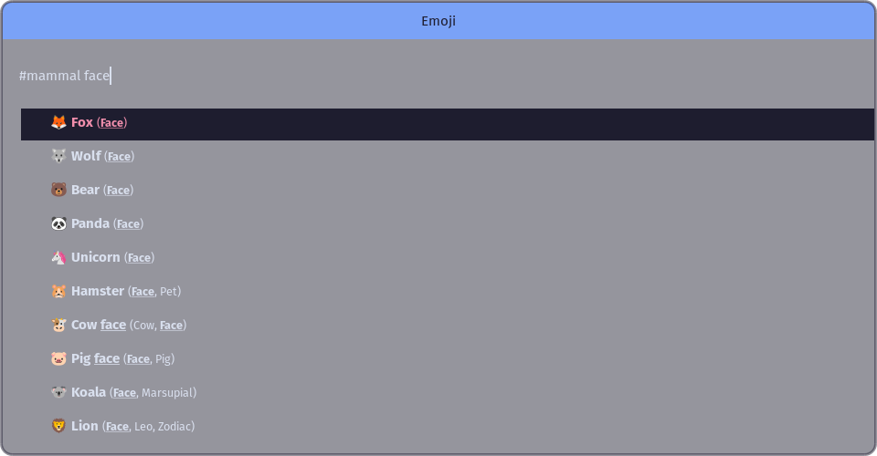
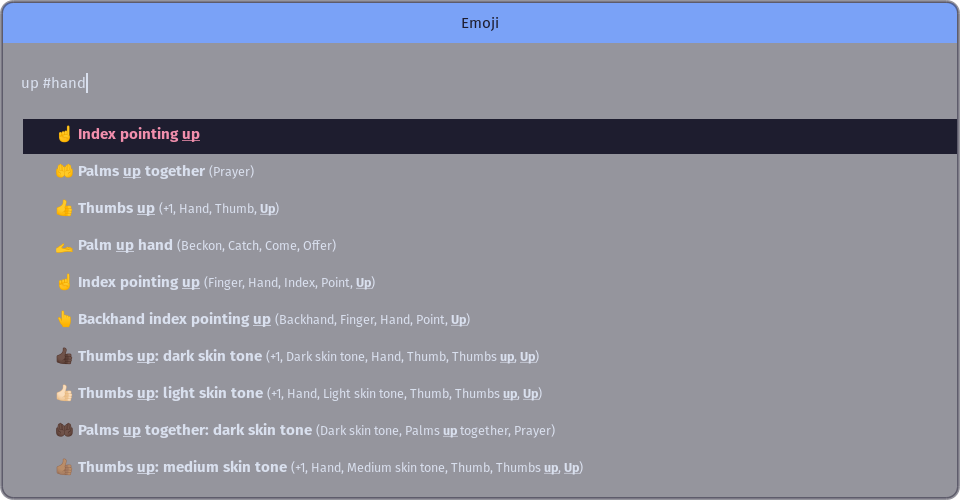
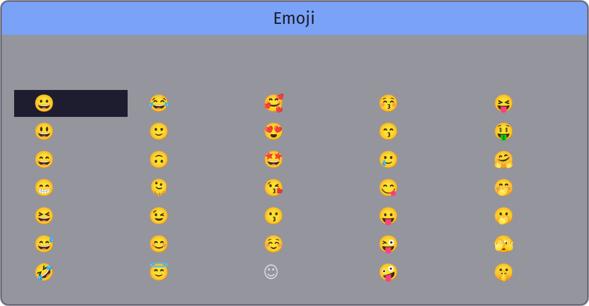

# Rofi emoji plugin

An emoji selector plugin for Rofi that copies the selected emoji to the
clipboard, among other things.

## Screenshots




## Usage

Run rofi like:

```bash
rofi -modi emoji -show emoji
```

### Keybindings

| Keymap            | Default key in Rofi               | Effect                                         |
|-------------------|-----------------------------------|------------------------------------------------|
| `kb-accept-entry` | <kbd>Enter</kbd>                  | Select emoji (see **Mode** below).             |
| `kb-accept-alt`   | <kbd>Shift</kbd>+<kbd>Enter</kbd> | Opens a menu for the Emoji with other actions. |
| `kb-custom-1`     | <kbd>Alt</kbd>+<kbd>1</kbd>       | Copy emoji.                                    |

> 💡 **Tip:** Change your `kb-custom-1` to <kbd>Ctrl</kbd>+<kbd>C</kbd>.
>
> ```
> rofi -modi emoji -show emoji -kb-custom-1 Ctrl+C
> ```

### Search patterns

You can type parts of the Emojis name or keywords to find it. If you want to
limit your search to particular groups or subgroups you can use prefix
searches:

* `@sym` - Limit to emojis that have `sym` inside of its Group, like `Symbols`.

  
* `#mammal` - Limit to emojis that have `mammal` inside of its Subgroup, e.g.
  `Animals & Nature » Animal-mammal`.

  
  

You can only use one instance inside of each prefix. The latest one wins:

* `@foo bar @baz` - Searches for `bar` on all emojis in a group including `baz`.

If you want to know which group and subgroup a particular emoji has, you can
open the menu on it. See **Menu** below.


### Menu

By pressing the `kb-accept-alt` binding on an emoji the plugin will open a menu
for that particular emoji. The menu will provide you with alternative actions,
like copying the Emojis name or codepoint. Metadata about the emoji will also
be shown inside the menu in case you want to know what group it belongs to in
order to find it faster in the future.

### Command line arguments

Due to a limitation in Rofi's plugin system, this plugin cannot append
additional options to the output of `rofi -help`.

The plugin adds the following command line arguments to `rofi`:

| Name            | Description                                              |
|-----------------|----------------------------------------------------------|
| `-emoji-mode`   | Default action when selecting an emoji in the search.    |
| `-emoji-file`   | Path to custom emoji database file.                      |
| `-emoji-format` | Custom formatting string for rendering lines. See below. |

#### Mode

The plugin supports four modes:

1. `insert` (default) - Copies the selected emoji, and then tries to insert it
   directly in the focused window.
2. `copy` - Only copies the selected emoji to your clipboard without trying to
   insert anything.
3. `menu` - Open the menu. Useful if you prefer to always get options when just
   pressing <kbd>Enter</kbd>.
4. `stdout` - Write selected emoji to standard output. This is useful if you
   want to use the emoji selector inside of a shell pipeline, like Rofi's
   `-dmenu` mode. It will use the `-format` argument to customize the outputted
   text, just like `-dmenu`.

Inserting is not very reliable under X11 since different toolkits respond
differently to the X11 events that are emitted when trying to write unicode
characters. If inserting does not work for you, you can still paste the emoji
as before.

In case you have any issues with insertion mode, you can override the default
mode using a `-emoji-mode copy` command line argument to Rofi.

The `copy` mode is also always available on `kb-custom-1`.

#### Format

The formatting string should be valid [Pango markup][pango] with placeholders
for the Emoji values found in the database.

The logic of this follows the same rule as Rofi's `-ssh-command` option,
quickly summarized as such:

* Items between curly braces (`{}`) are replaced with [Pango][pango]-escaped text.
* Wrapping an item inside brackets (`[]`) will hide the entire section if the
  value is empty.

The default format string is this:

```html
{emoji} <span weight='bold'>{name}</span>[ <span size='small'>({keywords})</span>]
```

This will render the emoji with its name next to it in bold, and if the emoji
has any keywords they will be shown in a parenthesised list with a smaller font
size.

| Item        | Example                                                                 |
|-------------|-------------------------------------------------------------------------|
| `emoji`     | 🤣                                                                      |
| `name`      | Rolling on the floor laughing                                           |
| `group`     | Smileys & Emotion                                                       |
| `subgroup`  | Face-smiling                                                            |
| `keywords`  | Face, Floor, Laugh, Rofl, Rolling, Rolling on the floor laughing, Rotfl |
| `codepoint` | U+1F923                                                                 |

|             |                                                                                                  |
|-------------|--------------------------------------------------------------------------------------------------|
| ⚠️ **NOTE:** | Rofi does not have a way to escape brackets, so you may not use literal `[]` inside your output. |

##### Example



```bash
rofi -modi emoji -show emoji -emoji-format '{emoji}'
```

## Dependencies

| Dependency | Version      |
|------------|--------------|
| rofi       | 1.7 (or git) |

### Optional dependencies

In order to actually use rofi-emoji an "adapter" need to be installed, as
appropriate for your environment.

| Kind   | Dependency   | Environment             |
|--------|--------------|-------------------------|
| Copy   | xsel         | X11                     |
| Copy   | xclip        | X11                     |
| Copy   | copyq        | X11                     |
| Copy   | wl-clipboard | Wayland                 |
|        |              |                         |
| Insert | xdotool      | X11                     |
| Insert | wtype        | Wayland                 |

You only need to install the ones required for your environment and usage. Note
that in order to use `insert` mode you must also install a `copy` adapter as
`insert` also copies as a fallback.

## Installation

<a href="https://repology.org/metapackage/rofi-emoji/versions">
    
</a>

### Arch Linux

```bash
pacman -S rofi-emoji
```

### Manjaro

```bash
pacman -S rofi-emoji
```

### Void Linux

```bash
xbps-install -S rofi-emoji
```

### NixOS

```bash
nix-env -e rofi-emoji
```

### Compile from source

`rofi-emoji` uses autotools as build system. On Debian/Ubuntu based systems you
will need to install the packages first:

- `rofi-dev`
- `autoconf`
- `automake`
- `libtool-bin`
- `libtool`

Download the source and run the following to install it:

```bash
autoreconf -i
mkdir build
cd build/
../configure
make
sudo make install
```

If you plan on developing the code and want to test the plugin, you can also
run `./run-development.sh`, which will do all setup steps for you and then
start Rofi using the locally compiled plugin and clipboard adapter script. This
will not affect your system and does not require root.

### Running tests

Also install `check` and run the following commands after doing the **Compile
from source** steps above.

```bash
# In project root
automake -a
cd build
../configure --with-check
make check VERBOSE=true
```

There is not a lot of things to test here since Rofi doesn't expose any of its
internal methods as a library to link the test binaries against, which means
it's not possible to compile and link any tests for any files where a Rofi
dependency is used.

## Emoji database

When installing, the emoji database is installed in
`$PREFIX/share/rofi-emoji/all_emojis.txt`.

The plugin will search `$XDG_DATA_DIRS` for a directory where
`rofi-emoji/all_emojis.txt` exists in if no `-emoji-file` option is set.

If the plugin cannot find the file, make sure `$XDG_DATA_DIRS` is set
correctly. If it is unset it should default to `/usr/local/share:/usr/share`,
which works with the most common prefixes.

### Custom database

The emoji database is a plain-text file that lists one emoji per line. It has
the following format:

```
EMOJI_BYTES        - The bytes of the emoji, for example "🤣". This is what is acted on.
\t                 - Tab character
GROUP_NAME         - The name of the group, for example "Smileys & Emotion".
\t                 - Tab character
SUBGROUP           - The name of the subgroup, for example "face-smiling".
\t                 - Tab character
NAME               - Name of emoji, for example "rolling on the floor laughing".
\t                 - Tab character
KEYWORD_1          - Keyword of the emoji, for example "rofl".
(" | " KEYWORD_n)… - Additional keywords are added with pipes and spaces between them.
\n                 - Newline ends the current record.
```

**Example rows:**

```
🤣	Smileys & Emotion	face-smiling	rolling on the floor laughing	face | floor | laugh | rofl | rolling | rolling on the floor laughing | rotfl
😂	Smileys & Emotion	face-smiling	face with tears of joy	face | face with tears of joy | joy | laugh | tear
🙂	Smileys & Emotion	face-smiling	slightly smiling face	face | slightly smiling face | smile
🙃	Smileys & Emotion	face-smiling	upside-down face	face | upside-down | upside down | upside-down face
```

### Updating default database to a newer version

The list is copied from the [Mange/emoji-data][emoji-data] repo.

## License

This plugin is released under the MIT license. See `LICENSE` for more details.

[emoji-data]: https://github.com/Mange/emoji-data
[pango]: https://docs.gtk.org/Pango/pango_markup.html
